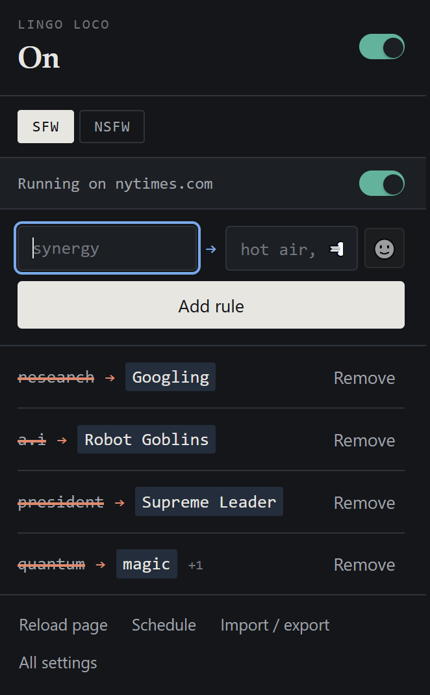
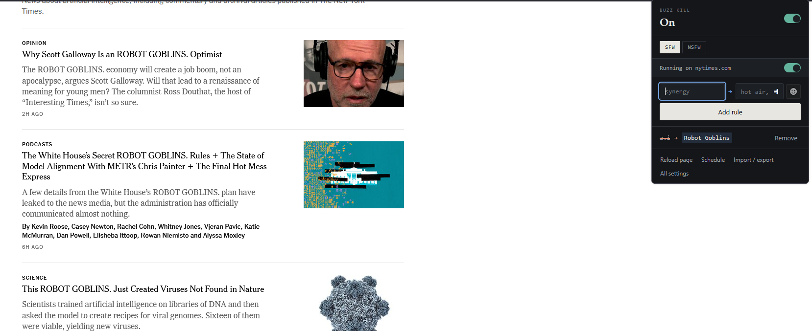
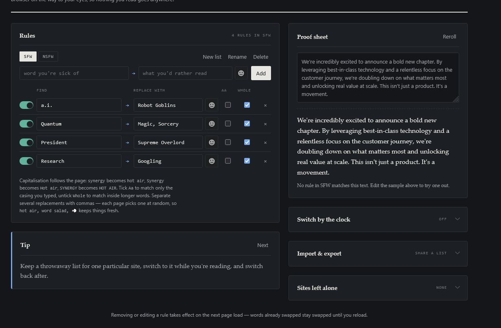

# Lingo Loco

**Swap the internet's favourite words for your own.**

The web only really knows about fifty words. Everything is *seamless*, everyone
is *doubling down*, every announcement *unlocks value at scale*. Lingo Loco
quietly rewrites them on the way to your eyes.

Tell it `synergy → hot air` and every page you visit for the rest of your life
says *hot air*. That's the whole idea.

### [➜ Get it for Firefox](https://addons.mozilla.org/firefox/addon/locolingo/)

  

---

## What you can do with it

**Swap anything for anything.** Words, phrases, emoji. `disrupt → 💥` works as
well as `thought leader → blogger`.

**Give a word several replacements** and each page picks one, so the joke keeps
its legs: `synergy → hot air, word salad, 💨`.

**Keep separate lists** — one for work, one for fun, one for that site that
annoys you — and switch between them in a click.

**Let the clock switch for you.** Polite vocabulary Monday to Friday 9–6,
whatever you like in the evening.

**Trade lists with friends.** Export as a file, or copy to the clipboard and
paste it in a chat. A good list is real work, and it's more fun shared.

  

---

## Getting started

Click the toolbar icon, type the word you're sick of, type what you'd rather
read, press **Add rule**. Reload the page. Done.

That's the whole tutorial. Everything else is optional, and the options page
shows you a tip each time you open it, so you'll pick the rest up as you go.

A few things worth knowing early:

- **Capitalisation sorts itself out.** One rule handles *synergy*, *Synergy* and
  *SYNERGY*.
- **Whole words by default**, so a rule for `cat` leaves *concatenate* in peace.
- **Your typing is never touched.** Search boxes, comments and code blocks keep
  the real word — you can still look things up.
- **The proof sheet** on the options page shows a sample paragraph being
  rewritten as you type, so you can try a rule before letting it loose.
- **Some sites should be left alone.** Add your bank, your work tools, anything
  where you need the real words. Subdomains come along automatically.

  

---

## Privacy

Nothing leaves your browser. No servers, no accounts, no analytics, no network
requests of any kind — your lists live on your machine, and what you read is
nobody's business.

The three permissions are: `storage` to keep your lists, `activeTab` so the
popup knows which site you're on, and site access because an extension can only
replace words on pages it's allowed to read.

---

## Something broken? An idea?

[Open an issue](../../issues) — bug reports, feature ideas and lists you think
should ship as presets are all welcome. If Lingo Loco has made your browsing
funnier, [a review on AMO](https://addons.mozilla.org/firefox/addon/buzz-kill/)
helps other people find it.

## For developers

It's plain JavaScript with no dependencies and no bundler — clone it, run
`./build.sh`, load `dist/unpacked/manifest.json` in
`about:debugging#/runtime/this-firefox`, and you're editing it.

`npm test` runs the suites. [CONTRIBUTING.md](CONTRIBUTING.md) has the layout and
the house style.

## Credits

Emoji names and search keywords come from
[Unicode CLDR](https://github.com/unicode-org/cldr-json), the same data behind
your phone's emoji keyboard.

MIT licensed — see [LICENSE](LICENSE).